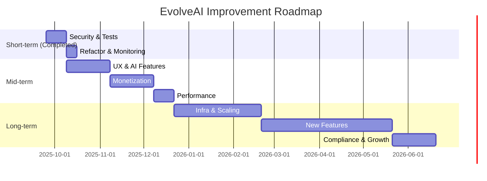

# План по улучшению проекта EvolveAI: Вывод на новый уровень

Короткосрочная фаза завершена (безопасность, тесты, рефакторинг, мониторинг реализованы).

## 2. Среднесрочная фаза: Улучшение UX и фич
Цель: Сделать бота более engaging, добавить монетизацию, оптимизировать AI.

- **UX/UI улучшения**:
  - Inline keyboards для навигации (handlers/keyboards.py): Добавить /profile с прогресс-барами отношений.(Сделано)

- **AI и память**:
  - Улучшить память: Vector search (e.g., pgvector в Postgres) вместо простого LIKE в long_term_memories.
  - Новые фичи: Voice input (STT via Gemini), daily quizzes для relationship building.

- **Монетизация и подписки**:
  - Расширить планы: Tiered subscriptions (basic/premium/pro) с features (e.g., pro — custom personalities).
  - Analytics: Track user journeys (e.g., funnel от /start до подписки) с Mixpanel.

- **Производительность**:
  - Background tasks: Celery + Redis для summarizer.py/TTS (убрать asyncio.create_task).
  - Кэширование: Redis для AI responses (TTL 5 мин), CDN для voice files.

- **Ожидаемый эффект**: Увеличение engagement (средний чат >10 сообщений), revenue от подписок >$1k/мес.

## 3. Долгосрочная фаза: Масштабирование и инновации
Цель: Преобразовать в полноценный сервис, добавить ML/аналитику.

- **Инфраструктура**:
  - Деплой: Kubernetes на GCP/AWS, auto-scaling для API/bot.
  - CI/CD: GitHub Actions (lint, test, deploy on merge).
  - Backup/DR: Postgres snapshots, Redis persistence.

- **Новые фичи**:
  - Сообщество: Group chats, user matching по profiles.
  - AI эволюция: Multi-modal (video analysis), integration с другими LLMs (e.g., Grok via API).
  - Analytics dashboard: Web-app (Streamlit/FastAPI) для admins (user stats, A/B results).

- **Compliance и рост**:
  - GDPR/Privacy: Consent flows, data deletion on request.
  - Marketing: Referral system (bonus days за invites), SEO для landing page.
  - A/B-тестирование: Для всех фич (e.g., разные personalities).

- **Ожидаемый эффект**: 10k+ users, multi-platform (web/discord), sustainable business.

## Roadmap (Mermaid диаграмма)

Короткосрочная фаза завершена, переходим к среднесрочной.